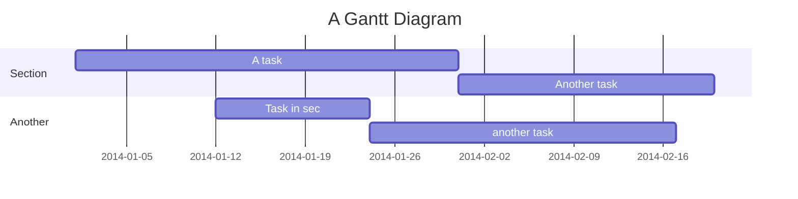

# This that are Expected to Learn from this Course
1. ROS Programming
2. Docker
3. Git
4. Build an autonomous robot from scratch at the end of the course

# Code Snippets from Terminal and git
## Code from #3+
### To generate a personal ssh key 
```terminal
ssh-keygen
```
   To view the contents of the file
```terminal
cat `file path`
```
   To test the setup after adding ssh key to profile
```terminal 
ssh -T git@fbe-gitlab.hs-weingarten.de
```
## Code from #4+
### Tips and Tricks in Bash 
Search in History
   ctrl + r
Command help:
   <command> --help
Manpage:
   man <command>

## Code from #5+
### Interaction with Repo
To run a shell script. Shell scripts end with `.sh`
   sh <file path>.sh / ./<filename>.sh

## Code from #6+
### Dump you Bash History into a file
To create a file:
   touch <file name>
To close an issue directly from commit, mention fixes #6 or closes #6 somewhere in the commit message.

## Gantt Diagram

